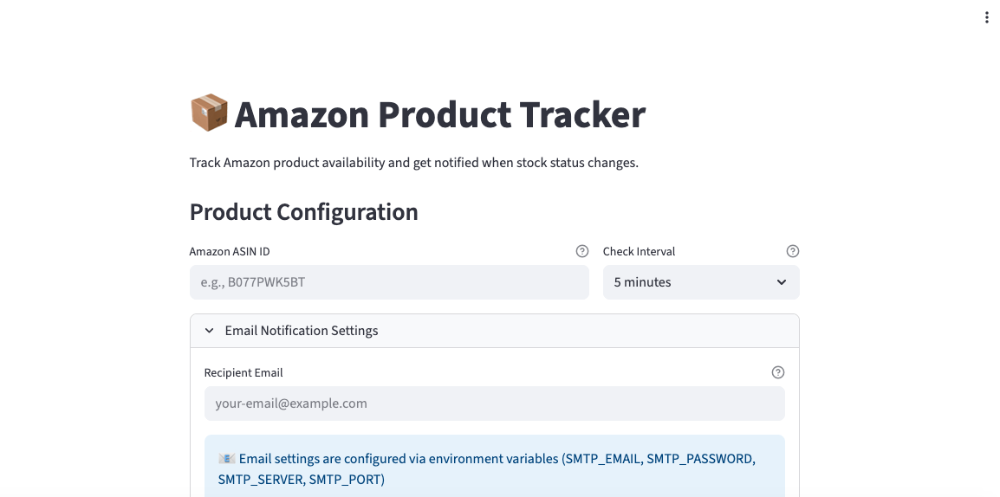

# 📦 Amazon Product Tracker

Aplicación **web-based** que monitorea la disponibilidad de productos en Amazon mediante su **ASIN** y envía notificaciones por correo electrónico cuando cambia el estado del stock.  
La aplicación utiliza **web scraping** para revisar el estatus de los productos y una interfaz en **Streamlit** para configurar y visualizar el monitoreo en tiempo real.

🌐 **Demo en vivo:** [AmazonTracker-mockup](https://amazontracker-mockup.onrender.com)

---

## 📝 Overview
- Monitoreo de productos específicos por **ASIN**.  
- Notificaciones por correo cuando cambia la disponibilidad.  
- Interfaz sencilla en **Streamlit** con logs en tiempo real.  
- Configuración de intervalos de chequeo y destinatarios de email.  

---

## 🖼️ Capturas


*(agrega aquí más capturas de la app en acción, incluyendo la vista desde Render y móvil)*

---

## 🏗️ Arquitectura del Sistema

### 🔹 Frontend
- **Streamlit Web App**: interfaz interactiva en una sola página.  
- **Session State Management**: conserva estado de la app entre interacciones.  
- **Real-time Logging**: muestra actividad y actualizaciones de estatus en vivo.  

### 🔹 Backend
- **Modular Design**:  
  - `amazon_tracker.py`: scraping y extracción de datos.  
  - `email_notifier.py`: notificaciones vía SMTP.  
  - `app.py`: orquesta la UI y el tracking en background.  
- **Scraping con BeautifulSoup + requests**.  
- **Anti-detección**: headers tipo navegador, delays aleatorios, manejo de sesiones.  
- **Tracking por ASIN**: usa identificadores únicos de Amazon.  

### 🔹 Procesamiento en segundo plano
- **Threading Architecture**: monitoreo en paralelo, UI siempre responsiva.  
- **Intervalos configurables**.  
- **Comunicación thread-safe** entre workers y UI.  

### 🔹 Sistema de notificaciones
- **SMTP integration**: correo configurable (por defecto Gmail).  
- **Variables de entorno** para credenciales seguras.  
- **Change detection**: solo envía notificación si cambia el estado de stock.  

---

## 📦 Dependencias
### Core
- [Streamlit](https://streamlit.io/) — Web framework para UI.  
- [BeautifulSoup4](https://www.crummy.com/software/BeautifulSoup/) — Parsing HTML.  
- [Requests](https://docs.python-requests.org/) — HTTP client.  
- [lxml](https://lxml.de/) — Parsing rápido de HTML/XML.  

### Email
- **SMTP estándar** (Gmail por defecto).  
- Variables necesarias:
  ```bash
  SMTP_EMAIL
  SMTP_PASSWORD
  SMTP_SERVER
  SMTP_PORT
